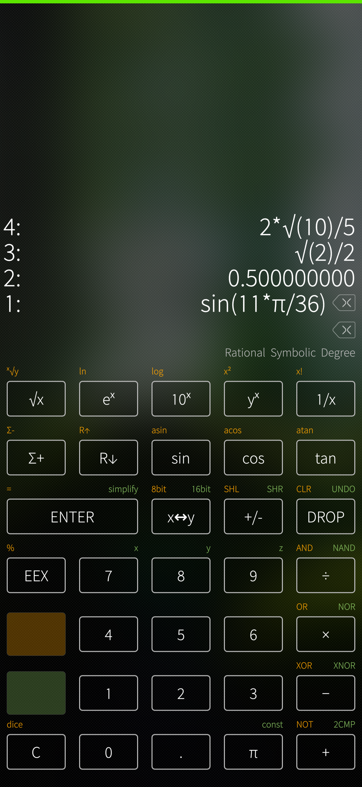
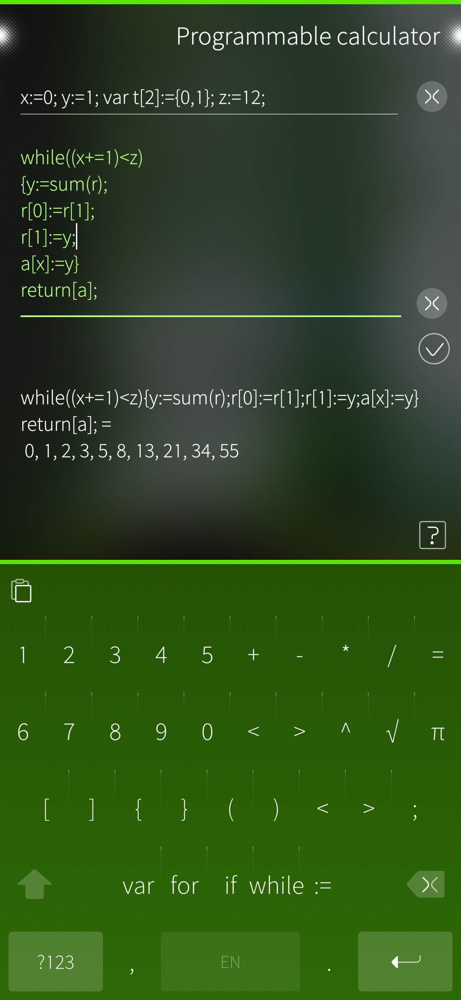

# fibonacci
Full symbolic RPN calculator using Sympy with a programmable calculator using exprtk c++. For SailfishOs.

Based in part on https://github.com/lainwir3d/sailfish-rpn-calculator

I've extended it with an interface to exprtk for programmable calculations. Eventually, I'll expose the sympy interfaces in a similar fashion.

It may all be merged back into @lainvir3d's project if he is so inclined.

